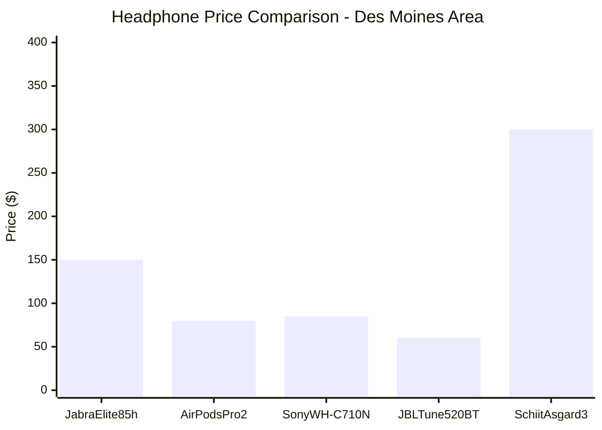
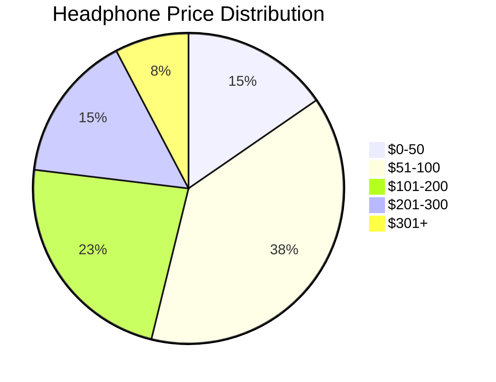
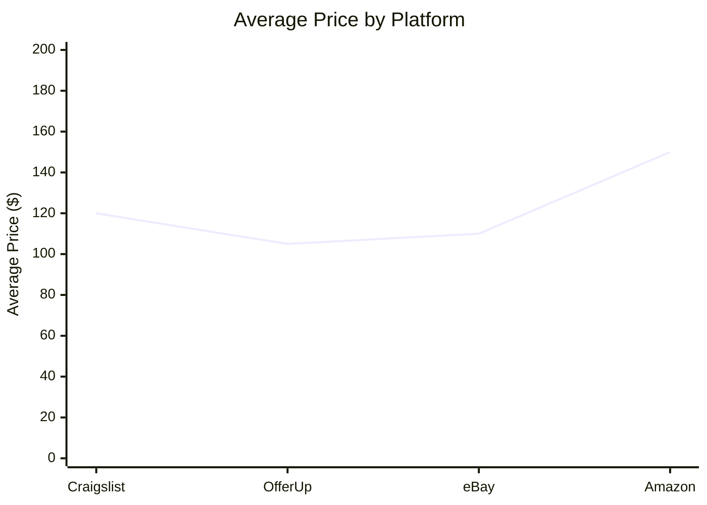

# Mermaid Chart Examples for Price Comparison

## Quick Reference: Mermaid Chart Types

### 1. Bar Chart (Price Comparison)



### 2. Multi-Platform Comparison

```mermaid
xychart-beta
    title "Price Comparison Across Platforms"
    x-axis [Craigslist, OfferUp, eBay Avg]
    y-axis "Price ($)" 0 --> 300
    bar [150, 250, 130]
    bar [80, 80, 120]
    bar [85, 85, 90]
    bar [60, 60, 70]
```



### 3. Pie Chart (Price Distribution)



### 4. Line Chart (Price Trends)



## How to Generate These in SlashMCP

### Method 1: Direct Mermaid Code

Just paste the Mermaid code in your chat response - it will render automatically if the markdown renderer supports it.

### Method 2: Use Gemini to Generate

```
/gemini-mcp generate_text prompt="Create a Mermaid xychart-beta bar chart comparing headphone prices. Use this data:
- Jabra Elite 85h: $150 (Craigslist), $250 (OfferUp), $130 (eBay avg)
- AirPods Pro 2: $80 (OfferUp), $120 (eBay avg)
- Sony WH-C710N: $85 (OfferUp), $90 (eBay avg)
- JBL Tune 520BT: $60 (OfferUp), $70 (eBay avg)

Create a chart with proper Mermaid syntax wrapped in code blocks." system="You are a data visualization expert. Always output valid Mermaid syntax."
```

### Method 3: Use LangChain Agent

```
/langchain-agent agent_executor query="Create a Mermaid bar chart from this price data: [paste your data]. Format as markdown code block with mermaid syntax." system_instruction="You are a data visualization expert. Always create valid Mermaid charts in markdown code blocks."
```

## Complete Example Output

Here's what a complete comparison might look like:

```markdown
## Headphone Price Comparison - Des Moines Area

### Summary Table

| Product | Craigslist | OfferUp | eBay Avg | Best Deal | Savings |
|---------|-----------|---------|----------|-----------|---------|
| Jabra Elite 85h | $150 | $250 | $130 | Craigslist | $20 vs eBay |
| AirPods Pro 2 | - | $80 | $120 | OfferUp | $40 vs eBay |
| Sony WH-C710N | - | $85 | $90 | OfferUp | $5 vs eBay |
| JBL Tune 520BT | - | $60 | $70 | OfferUp | $10 vs eBay |
| Schiit Asgard 3 | $300 | - | $280 | eBay | $20 vs Craigslist |

### Price Comparison Chart

\`\`\`mermaid
xychart-beta
    title "Headphone Price Comparison"
    x-axis [Jabra Elite 85h, AirPods Pro 2, Sony WH-C710N, JBL Tune 520BT]
    y-axis "Price ($)" 0 --> 300
    bar [150, 80, 85, 60]
\`\`\`

### Best Deals

1. **Jabra Elite 85h**: $150 on Craigslist (best price)
2. **AirPods Pro 2**: $80 on OfferUp (best price)
3. **JBL Tune 520BT**: $60 on OfferUp (best price)
```

## Tips

1. **Always wrap Mermaid in code blocks** with `mermaid` language tag
2. **Use xychart-beta** for bar/line charts (newer syntax)
3. **Keep chart simple** - too many data points can be hard to read
4. **Add titles and labels** for clarity
5. **Use consistent colors** if creating multiple charts

## Testing

To test if Mermaid works in your chat:
1. Paste a simple Mermaid chart
2. Check if it renders
3. If not, the markdown renderer may need Mermaid support enabled


