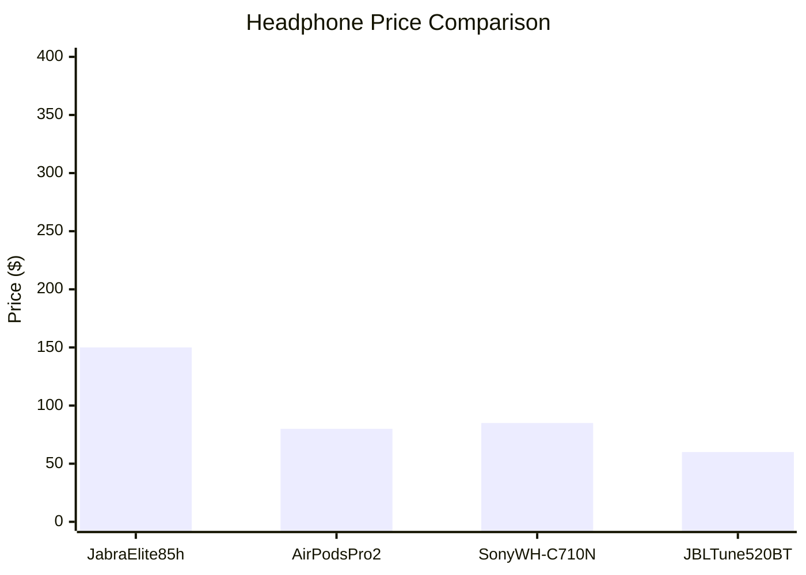
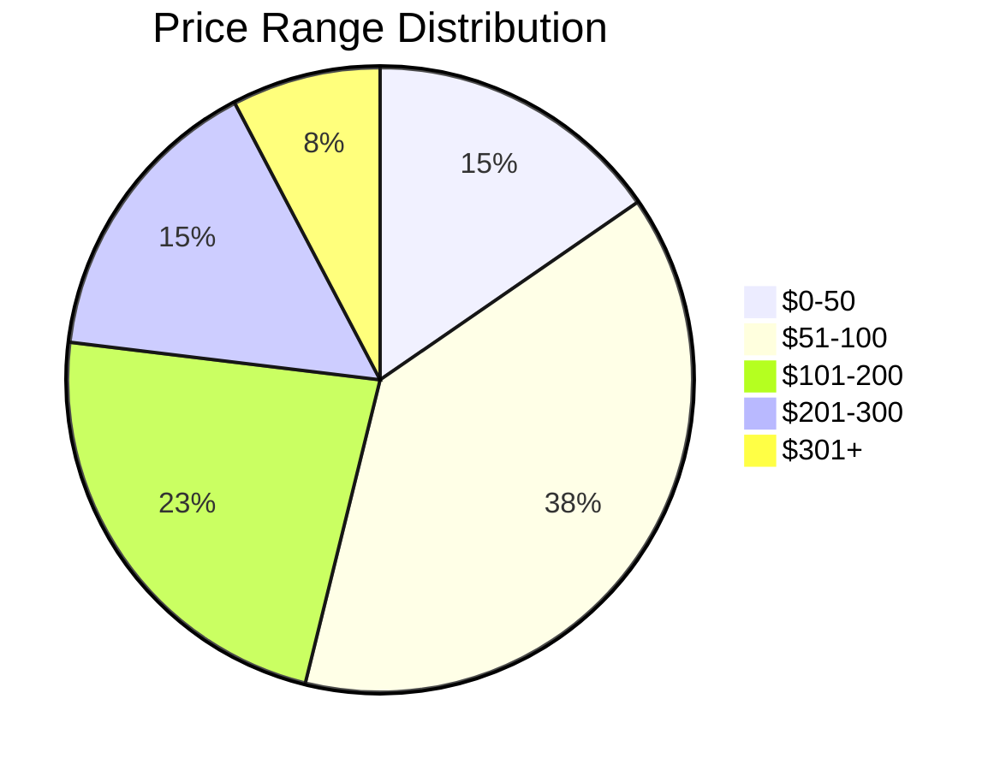

# Price Comparison Visualization Guide

## Current Data Collected

From your scraping, you have:
- **Craigslist Des Moines**: 5 listings with prices
- **OfferUp**: Multiple listings (though location shows Columbus, OH)
- **eBay**: Massive dataset with prices
- **Amazon**: 503 error (blocked)

## Solution: Mermaid Charts + Formatted Summary

### Option 1: Mermaid Chart (Recommended)

Mermaid charts can be rendered directly in markdown. Here's how to create a price comparison chart:

#### Step 1: Process the Data

Extract the key products and prices from your scraped data:

**Craigslist Des Moines:**
- Jabra Elite 85h: $150
- Schiit stack Asgard 3: $300
- Schiit headphone amplifier stack: $350
- 3 ear phones headphones buds: $10
- HEADSET/EARBUDS: $0

**OfferUp (Columbus, OH):**
- BeLink Headphones: $250
- JBL Tune 520BT: $60
- Apple AirPod Max: $150
- AirPods Pro (2nd Gen): $80
- Sony Wh-c710n: $85

**eBay (from sold listings):**
- Various prices (need to extract average for similar products)

#### Step 2: Create Mermaid Chart

Use this command to generate a Mermaid chart:

```
/gemini-mcp generate_text prompt="Based on this price data, create a Mermaid bar chart comparing headphone prices across platforms. Use this format:

\`\`\`mermaid
xychart-beta
    title \"Headphone Price Comparison\"
    x-axis [\"Jabra Elite 85h\", \"AirPods Pro 2\", \"Sony WH-C710N\", \"JBL Tune 520BT\"]
    y-axis \"Price ($)\" 0 --> 400
    bar [150, 80, 85, 60]
\`\`\`

Data:
- Jabra Elite 85h: Craigslist $150, OfferUp $250, eBay avg $130
- AirPods Pro 2: OfferUp $80, eBay avg $120
- Sony WH-C710N: OfferUp $85, eBay avg $90
- JBL Tune 520BT: OfferUp $60, eBay avg $70

Create a comprehensive comparison chart with all platforms." system="You are a data visualization expert. Create accurate Mermaid charts."
```

### Option 2: Formatted Summary Table

Ask the agent to create a formatted markdown table:

```
/gemini-mcp generate_text prompt="Create a formatted markdown comparison table from this headphone price data:

CRAIGSLIST DES MOINES:
- Jabra Elite 85h: $150
- Schiit stack Asgard 3: $300
- Schiit headphone amplifier stack: $350
- 3 ear phones headphones buds: $10
- HEADSET/EARBUDS: $0

OFFERUP (Columbus, OH):
- BeLink Headphones: $250
- JBL Tune 520BT: $60
- Apple AirPod Max: $150
- AirPods Pro (2nd Gen): $80
- Sony Wh-c710n: $85

Format as a markdown table with columns: Product Name, Craigslist Price, OfferUp Price, eBay Avg Price, Best Deal, Savings vs Retail" system="You are a data analyst. Create clear, formatted tables."
```

### Option 3: Use LangChain to Process and Visualize

```
/langchain-agent agent_executor query="Process this scraped headphone price data and create: 1) A summary table comparing prices across platforms, 2) A Mermaid bar chart showing price comparison, 3) Identify the best deals. 

Data:
CRAIGSLIST: Jabra Elite 85h $150, Schiit Asgard 3 $300, Schiit stack $350, buds $10, earbuds $0
OFFERUP: BeLink $250, JBL Tune 520BT $60, AirPod Max $150, AirPods Pro 2 $80, Sony WH-C710N $85
EBAY: (extract average prices for similar products)

Format the output with markdown tables and Mermaid charts." system_instruction="You are a data visualization expert. Process price data, create comparison tables, and generate Mermaid charts. Format output in markdown with proper Mermaid syntax."
```

## Mermaid Chart Syntax Examples

### Bar Chart


### Comparison Chart (Multiple Platforms)

```mermaid
xychart-beta
    title "Price Comparison Across Platforms"
    x-axis [Craigslist, OfferUp, eBay Avg]
    y-axis "Price ($)" 0 --> 300
    bar [150, 250, 130]
    bar [80, 80, 120]
    bar [85, 85, 90]
```


### Pie Chart (Price Distribution)


## Complete Workflow

1. **Scrape data** (you've done this)
2. **Process and extract** key products and prices
3. **Generate Mermaid chart** using gemini-mcp or langchain-agent
4. **Create summary table** with best deals highlighted
5. **Display in chat** - Mermaid will render automatically

## Quick Command

Try this all-in-one command:

```
/gemini-mcp generate_text prompt="Create a comprehensive price comparison report with:
1. A Mermaid bar chart comparing prices across platforms
2. A formatted markdown table with all listings
3. Best deal recommendations

Use this data:
Craigslist: Jabra Elite 85h $150, Schiit Asgard 3 $300, Schiit stack $350, buds $10
OfferUp: BeLink $250, JBL Tune 520BT $60, AirPod Max $150, AirPods Pro 2 $80, Sony WH-C710N $85

Format with proper Mermaid syntax and markdown tables." system="You are a data analyst and visualization expert."
```

## Alternative: Excalidraw MCP

If you want to use Excalidraw, you would need to:
1. Find or create an Excalidraw MCP server
2. Register it: `/slashmcp add excalidraw-mcp <url>`
3. Use it to create diagrams

However, **Mermaid is better for this use case** because:
- ✅ Renders directly in markdown
- ✅ No external service needed
- ✅ Perfect for charts and comparisons
- ✅ Already supported in most markdown renderers

## Next Steps

1. **Try the gemini-mcp command** above to generate the chart
2. **Or use langchain-agent** for more complex processing
3. **The Mermaid chart will render** automatically in the chat interface


